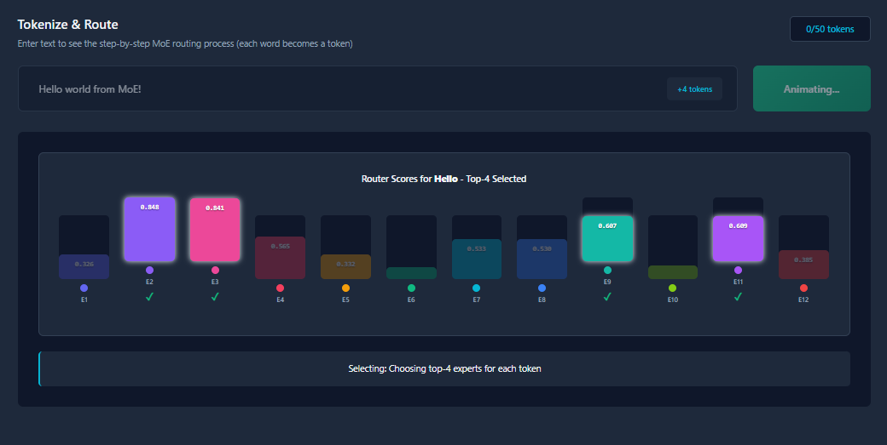
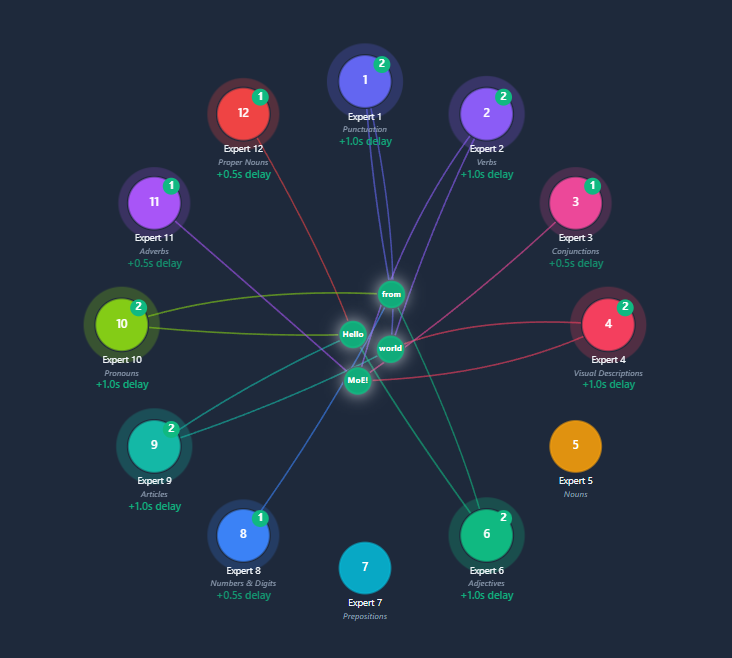

# MoE Visualizer

An interactive visualization tool for understanding Mixture of Experts (MoE) models. Watch tokens flow through expert networks, see load balancing in action, and explore how MoE architectures work with real-time animations.

🔗 **[Live Demo](https://nsusanto.github.io/MoE-Visualizer/)**



## Features

### 🎨 Interactive Visualizations
- **Token Routing**: Watch tokens being routed to top-K experts in real-time
- **Expert Network**: Circular layout showing all experts and their specializations
- **Routing Lines**: Curved lines showing routing weights with color-coded experts
- **Batch Processing**: Visualize how experts process multiple tokens simultaneously

### 📊 Real-Time Metrics
- **Auxiliary Loss**: Measures routing-dispatch mismatch using the formula from research papers (N × Σ(f_e × P_e))
- **Load Imbalance Factor**: Coefficient of variation showing distribution balance
- **Expert Utilization**: Percentage breakdown of token distribution across experts
- **Router Histogram**: Softmax scores and top-K selection for each token

### 🎯 Expert Detail View
- **FFN Computation**: Neural network diagram showing feed-forward processing
- **Batch Information**: See which tokens are being processed together
- **Stage-by-stage Animation**: Watch data flow through input → FFN1 → ReLU → FFN2 → output

### 📚 Educational Documentation
- **Technical explanations** of MoE concepts
- **Visual diagrams** explaining gating networks and routing
- **Mathematical formulas** with detailed breakdowns

## Quick Start

### Prerequisites
- Node.js 18+ 
- npm

### Installation

```bash
# Clone the repository
git clone https://github.com/nsusanto/MoE-Visualizer.git
cd MoE-Visualizer

# Install dependencies
npm install

# Start development server
npm run dev
```

Visit `http://localhost:3000` to see the app.

### Build for Production

```bash
npm run build
npm run preview
```

### Deploy to GitHub Pages

```bash
npm run deploy
```

## How to Use

1. **Add Tokens**: Enter text in the input field and click "Process Tokens" (or press Enter)
2. **Watch Animation**: See tokens route to top-K experts based on softmax scores
3. **View Metrics**: Click "Metrics" to see load balancing statistics
4. **Explore Experts**: Click on any expert circle to see its FFN computation
5. **Adjust Settings**: Change number of experts (2-16) and top-K selection (1-N)

## Project Structure

```
MoE-Visualizer/
├── src/
│   ├── components/
│   │   ├── common/         # Reusable UI components (StatusLegend)
│   │   ├── visualizers/    # Main visualization components
│   │   │   ├── AnimationPanel.tsx    # Token input & histogram
│   │   │   ├── ExpertNetwork.tsx     # Main SVG visualization
│   │   │   └── ExpertDetailPanel.tsx # FFN computation view
│   │   └── layout/         # Page layouts
│   │       ├── LandingPage.tsx
│   │       ├── VisualizerPage.tsx
│   │       └── DocsPage.tsx
│   ├── store/
│   │   ├── moeStore.ts         # Configuration state
│   │   └── simulationStore.ts  # Simulation & tokens state
│   ├── types/
│   │   └── moe.types.ts        # TypeScript interfaces
│   └── utils/
│       ├── moeInitialization.ts  # Expert & token generation
│       └── routing.ts            # Softmax & top-K selection
└── public/
    └── assets/             # Documentation images
```

## Key Concepts

### Mixture of Experts (MoE)
A neural network architecture that uses multiple "expert" networks, with a gating mechanism that routes inputs to the most relevant experts. This enables:
- **Conditional computation**: Only a subset of parameters are used per input
- **Scalability**: Add more experts without increasing computation per token
- **Specialization**: Different experts learn different patterns

### Implementation Details
- **Gating Network**: Softmax over expert scores determines routing probabilities
- **Top-K Selection**: Only the top K experts with highest scores process each token
- **Load Balancing**: Auxiliary loss encourages balanced expert utilization
- **Batch Processing**: Tokens are processed in batches when multiple tokens route to the same expert

## Contributing

Contributions are welcome! Please feel free to submit a Pull Request.

## License

MIT

## Resources

- [Switch Transformers Paper](https://arxiv.org/abs/2101.03961) - Introduced simplified MoE with expert capacity
- [GShard Paper](https://arxiv.org/abs/2006.16668) - Scaled MoE to 600B parameters
- [Mixture of Experts Explained (Blog)](https://huggingface.co/blog/moe) - Hugging Face's comprehensive guide
- [Maarten Grootendorst's Visual Guide](https://maartengrootendorst.substack.com/p/a-visual-guide-to-mixture-of-experts) - Excellent visual explanations

## Acknowledgments

Built with React, TypeScript, and SVG. Inspired by the growing interest in efficient large language models and the need for better educational tools to understand MoE architectures.

